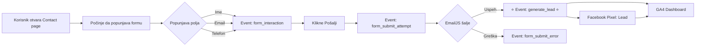

# 🎯 Lead Tracking - Implementacija Završena! ✅

<div align="center">

## ⭐ GLAVNI EVENT: `generate_lead` ⭐

**Automatski prati sve lead-ove sa kontakt formi!**

</div>

---

## 📊 Šta je implementirano?

### ✅ Contact Page (`/contact`)
```
Korisnik popunjava formu → Klikne "Pošalji" → ✅ generate_lead event!
```

### ✅ Home Page (`/` - forma na dnu)
```
Korisnik popunjava formu → Klikne "Pošalji" → ✅ generate_lead event!
```

### ✅ Google Analytics 4
- Property ID: **G-6C046QS9HG**
- Event: **`generate_lead`**
- Parametri: lead_source, language, user_name, value

### ✅ Facebook Pixel
- Pixel ID: **861131543475701**
- Event: **`Lead`**
- Konverzija tracking aktivan

---

## 🎨 Vizuelni Flow



---

## 📂 Struktura Projekta

```
AISAJT-main/
│
├── 📄 README_LEAD_TRACKING.md              ← VI STE OVDE
├── 📄 QUICK_START_ANALYTICS.md             ← Brzi vodič
├── 📄 ANALYTICS_IMPLEMENTATION.md          ← Kompletna dokumentacija
├── 📄 GOOGLE_ANALYTICS_EVENTS.md           ← Svi eventi detaljno
├── 📄 TESTING_ANALYTICS.md                 ← Test instrukcije
│
└── src/
    ├── components/
    │   ├── pages/
    │   │   └── ContactPage.tsx             ✅ Lead tracking DONE
    │   └── sections/
    │       └── Contact.tsx                 ✅ Lead tracking DONE
    │
    └── utils/
        ├── analytics.ts                    ✅ Helper funkcije
        └── README_ANALYTICS.md             ← API dokumentacija
```

---

## 🚀 Quick Start

### 1. Lokalno testiranje:

```bash
# Terminal:
cd AISAJT-main
npm run dev
```

### 2. Otvorite sajt:
```
http://localhost:5173/contact
```

### 3. Test:
1. Popunite kontakt formu
2. Kliknite "Pošalji"
3. **Otvorite Browser Console (F12)**
4. Videćete:
   ```
   ✅ Lead tracked: { 
     source: 'contact_page', 
     userName: 'Test User', 
     language: 'sr' 
   }
   ```

### 4. Proverite u GA4:
1. [Google Analytics](https://analytics.google.com)
2. Property: **G-6C046QS9HG**
3. **Reports → Realtime → Events**
4. Videćete: **`generate_lead`** event 🎉

---

## 📊 Eventi koji su implementirani

| Event | Kada se okida | Lokacija | Prioritet |
|-------|---------------|----------|-----------|
| **`generate_lead`** | ✅ Uspešno poslata forma | Contact & Home | ⭐⭐⭐ |
| `form_interaction` | Korisnik počne da piše | Contact & Home | ⭐⭐ |
| `form_submit_attempt` | Klik na "Pošalji" | Contact & Home | ⭐⭐ |
| `form_submit_error` | Greška pri slanju | Contact & Home | ⭐ |

---

## 🎯 Kako koristiti u GA4?

### Kreiranje Konverzije:
```
1. GA4 → Configure → Events
2. Pronađite: generate_lead
3. Mark as conversion ✅
4. Sačuvajte
```

### Kreiranje Custom Report-a:
```
1. Explore → Blank
2. Dimension: Event name = "generate_lead"
3. Metrics: Event count, Users
4. Breakdown by: lead_source, language
```

### Očekivani podaci:
- **Ukupno lead-ova**: Event count
- **Lead source**: Contact page vs Home page
- **Jezik**: Srpski vs Engleski korisnici
- **Conversion rate**: generate_lead / page_views

---

## 📱 Facebook Pixel

### Eventi:
```
Contact Form Success → FB Pixel "Lead" event
```

### Provera:
```
1. Facebook Events Manager
2. Pixel ID: 861131543475701
3. Test Events → Real-Time
4. Videćete "Lead" event
```

---

## 🔧 Helper API

### Import:
```typescript
import { 
  trackLeadGeneration,
  trackCTAClick,
  trackPortfolioClick 
} from './utils/analytics';
```

### Primeri:

**Lead (automatski):**
```typescript
trackLeadGeneration('contact_page', userName, language);
```

**CTA Button:**
```typescript
trackCTAClick('Saznaj Više', 'services', language);
```

**Portfolio:**
```typescript
trackPortfolioClick('Kralj Residence', url, language);
```

**Više:** `src/utils/README_ANALYTICS.md`

---

## 🎨 Console Output

Kada korisnik pošalje formu, u konzoli vidite:

```javascript
// ✅ Uspeh:
✅ Lead tracked: {
  source: "contact_page",
  userName: "Marko Marković",
  language: "sr"
}

// ❌ Greška:
❌ Error tracking lead: NetworkError
```

---

## 📈 Metrike koje možete pratiti

| Metrika | Formula | Dobra vrednost |
|---------|---------|----------------|
| **Conversion Rate** | leads / page_views × 100% | 5-10% |
| **Form Abandonment** | (starts - leads) / starts × 100% | < 50% |
| **Error Rate** | errors / attempts × 100% | < 5% |
| **Lead Value** | ukupno leads × vrednost | Raste ⬆️ |

---

## 🐛 Troubleshooting

### Problem: Ne vidim event u konzoli
**Rešenje:** 
```javascript
// Test u konzoli:
console.log('GA:', typeof window.gtag !== 'undefined');
console.log('FB:', typeof window.fbq !== 'undefined');
```

### Problem: Ne vidim event u GA4
**Rešenje:**
- Isključite Ad Blocker
- Sačekajte 30 sekundi
- Proverite Property ID

### Problem: FB Pixel ne radi
**Rešenje:**
- Instalirajte: [Facebook Pixel Helper](https://chrome.google.com/webstore/detail/facebook-pixel-helper/)
- Proverite Pixel ID: 861131543475701

**Detaljan guide:** `TESTING_ANALYTICS.md`

---

## ✅ Production Checklist

Pre nego što ide live na aisajt.com:

- [x] GA Property ID konfigurisano
- [x] FB Pixel ID konfigurisano
- [x] Contact Page tracking implementiran
- [x] Home Page tracking implementiran
- [x] TypeScript types dodati
- [x] Helper functions kreirani
- [x] Debug logging aktivan
- [ ] **Testirano na produkciji** ← Sledeći korak!
- [ ] Konverzija kreirana u GA4
- [ ] Prvi pravi lead primljen 🎉

---

## 📚 Dodatna Dokumentacija

| Fajl | Sadržaj |
|------|---------|
| **QUICK_START_ANALYTICS.md** | 5-minutni vodič |
| **ANALYTICS_IMPLEMENTATION.md** | Kompletna tehnička dokumentacija |
| **GOOGLE_ANALYTICS_EVENTS.md** | Svi eventi sa parametrima |
| **TESTING_ANALYTICS.md** | Test scenarios i debug |
| **src/utils/README_ANALYTICS.md** | Helper API dokumentacija |

---

## 🎉 Gotovo!

### Šta sledeće?

1. ✅ **Testirajte lokalno** - popunite formu i proverite konzolu
2. ✅ **Deploy na produkciju** - build i upload
3. ✅ **Kreirajte konverziju** u GA4 dashboard
4. ✅ **Pratite lead-ove** u Real-Time
5. 🚀 **Optimizujte** na osnovu podataka!

---

<div align="center">

## 🎯 Prvi Lead = Prvi Uspeh! 🎉

**Google Analytics ID:** G-6C046QS9HG  
**Facebook Pixel ID:** 861131543475701

---

**Developed by:** AISajt Team  
**Date:** 2025-01-XX  
**Version:** 1.0  

---

### 📞 Support
**Email:** office@aisajt.com  
**Phone:** +381 61 3091583  
**Website:** https://aisajt.com

</div>

